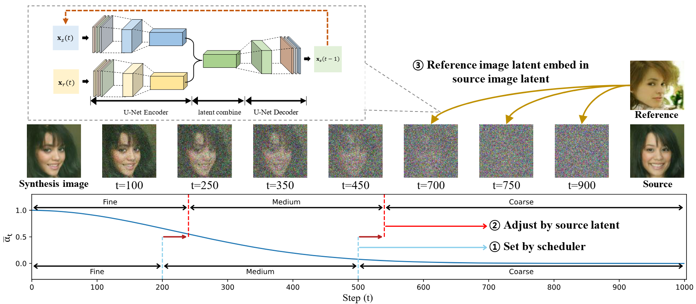

# Coarse-to-fine_Generation_of_Diffusion
"**Analyzing Coarse-to-fine Generation of Diffusion Models from the Image Editing Perspective ([ACM SIGAPP 2026](https://dl.acm.org/doi/abs/10.1145/3748522.3779967))**"


<p align="center">
  
</p>


We use diffusers, the link below has details.
🤗 https://github.com/huggingface/diffusers

Here is the file we modified:
- diffusers/models/unet_2d.py
- diffusers/schedulers/scheduling_ddpm.py
- diffusers/pipelines/ddpm/pipeline_ddpm.py

The parts we modified in diffusers are expressed as annotations (TIP).

## Requirements

- CUDA == 11.1
- cudnn == 8.1.0
- numpy == 1.19.5
- scikit-learn == 0.24.2
- torch == 1.8.1+cu111
- torchvision == 0.9.1+cu111
- diffusers == 0.13.1


## Implementation

python run.py

## Acknowledgement

```bibtex
@misc{von-platen-etal-2022-diffusers,
  author = {Patrick von Platen and Suraj Patil and Anton Lozhkov and Pedro Cuenca and Nathan Lambert and Kashif Rasul and Mishig Davaadorj and Thomas Wolf},
  title = {Diffusers: State-of-the-art diffusion models},
  year = {2022},
  publisher = {GitHub},
  journal = {GitHub repository},
  howpublished = {\url{https://github.com/huggingface/diffusers}}
}
```
